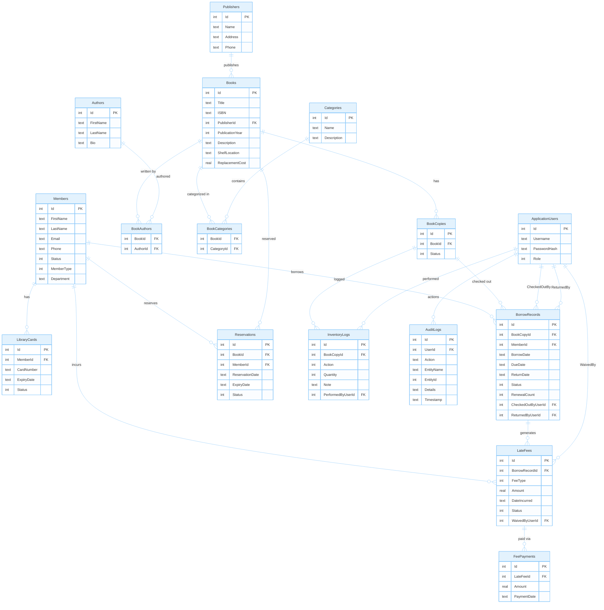

# Library Management System

Ứng dụng desktop quản lý thư viện — .NET 10 WinForms + EF Core SQLite.

## Chức năng

- **Quản lý Sách**: CRUD sách, tìm kiếm theo tên/ISBN/tác giả/thể loại, lọc theo trạng thái
- **Quản lý Bản sao**: Barcode tự động, gán kệ sách, đổi trạng thái
- **Quản lý Độc giả**: CRUD, phân loại SV/GV/NV/Ngoài trường, import CSV
- **Quản lý Thẻ thư viện**: Cấp thẻ, gia hạn, khóa/mở
- **Mượn/Trả sách**: Kiểm tra điều kiện, tính ngày hẹn trả, trả nhiều sách
- **Gia hạn**: Max 2 lần, chặn nếu có reservation hoặc nợ phạt
- **Đặt trước sách**: Hàng chờ FIFO, thông báo khi sách có lại
- **Phạt & Thanh toán**: Phạt trễ/mất/hỏng, thanh toán, miễn phạt
- **Kiểm kê kho**: Nhập sách, thanh lý, chuyển kệ, báo mất/hỏng
- **Báo cáo**: Sách mượn nhiều, quá hạn, tổng phạt, thống kê theo thời gian
- **Auth**: Đăng nhập, phân quyền Admin/Librarian/Staff, audit log

## Cấu trúc thư mục

```
WinFormsApp1/
├── Models/              # Entity classes
│   └── Enums/           # CopyStatus, BorrowStatus, MemberStatus, FeeStatus, UserRole
├── Data/                # AppDbContext, Repository, UnitOfWork, schema.sql, diagrams
├── Services/            # Business logic services
├── Helpers/             # Password hashing, session management
├── Forms/               # WinForms UI
└── Program.cs           # Entry point + DI setup
```

## Yêu cầu

- .NET 10 SDK
- SQLite (tự động tạo database khi chạy lần đầu)

## Cài đặt

```bash
# Clone
git clone https://github.com/thaiannguyen-05/lib-management.git
cd lib-management/WinFormsApp1

# Chạy
dotnet run
```

## Database Schema

18 tables | 5 enums | 16 relationships



## Architecture

- **UI**: WinForms (.NET 10)
- **ORM**: Entity Framework Core 10 (SQLite)
- **Pattern**: Repository + Service layers
- **Auth**: Username/password with salted hash
- **Concurrency**: Single machine, single user

## Issues

[Xem danh sách issue](https://github.com/thaiannguyen-05/lib-management/issues)

## License

MIT
